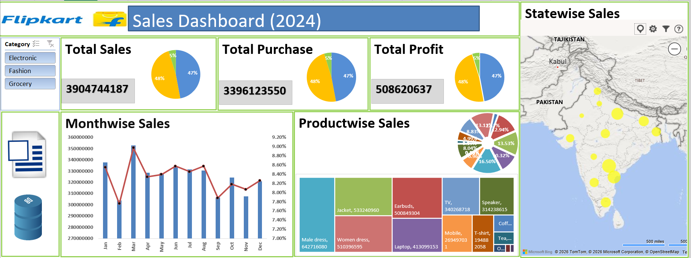

# Excel-Sales-Dashboard 

## 📊 Project Overview
-Developed an interactive Sales Dashboard using Microsoft Excel to analyze and visualize business performance metrics. 
-The dashboard provides insights into monthly revenue trends, top-performing products, and region-wise sales comparison using pivot tables and charts. 
-The objective of this project was to convert raw sales data into actionable insights through effective data visualization techniques.

## 📁 File Structure
The Excel file contains:
- Cleaned Sales Dataset
- Pivot Tables for analysis
- Interactive Dashboard Sheet
- 
 ## 📁 Project File
[Download Excel Sheet](./Sales_Dashboard.xlsx)

## 🛠 Tools & Techniques Used
- Microsoft Excel
- Pivot Tables
- Pivot Charts
- Slicers
- Data Visualization

## 📈 Key Insights Generated
- Monthly revenue trend analysis
- Region-wise performance comparison
- Identification of top-performing products
- Sales distribution by category

## 🎯 Objective
To design a data-driven sales performance dashboard that supports strategic decision-making by identifying revenue trends, high-performing products, and regional growth opportunities.
